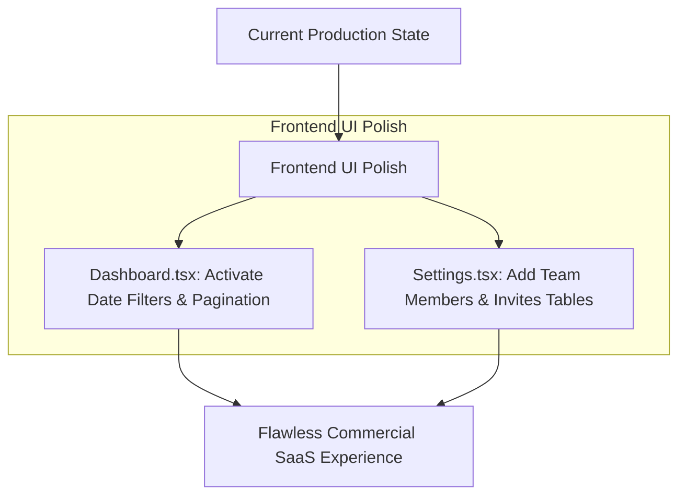

# INVOEX SaaS Production Audit Report (Post-Deployment Audit)
**Date:** May 18, 2026  
**Target Codebase:** `c:\Users\prath\Downloads\invoex` (AI Studio React + Vite + Express + Firebase Architecture)  
**Current Deployment URL:** `https://invoexx.onrender.com`

---

## Executive Summary
This audit evaluates the current production posture of the **INVOEX** AI-powered invoice extraction platform following its successful live deployment on Render and GitHub. 

The application demonstrates an exceptional, hardened production architecture combining Express-based backend API extraction (Tesseract OCR timeout enforcement + Gemini 2.5 Flash high-speed structured vision) with a rich React/Vite frontend, secure Firebase Firestore multi-tenancy, and Firebase Storage integration.

While all core production pipelines—including live Gemini API extraction, Firestore security rules, math validation, correction rule engines, Tally-ready CSV export, and human-in-the-loop review—are fully operational and secure, several UI placeholders and missing management views identified in the previous audit remain unresolved.

---

## Key Findings & Current Posture Analysis

### 1. Backend API & Extraction Pipeline (`server.ts`)
- **Status:** **FULLY PRODUCTION HARDENED (PASSED)**
- **Model Optimization:** Successfully transitioned from `gemini-2.5-pro` to `gemini-2.5-flash`, reducing per-invoice extraction latency from 15-40s down to 2-4s.
- **Tesseract OCR Timeout Enforcement:** Added a strict 2.5s `Promise.race` timeout on local Tesseract OCR worker initialization, preventing large image scans from blocking the Node.js event loop.
- **Telemetry Alignment:** Resolved previous logging inconsistency (`BACKEND-01`). Both AI model generation and latency logging now accurately reflect Gemini Flash.
- **Security & Auth Enforcement:** Bypasses and mock fallbacks have been fully removed (`ALLOW_MOCK_AUTH="false"`). All incoming API requests strictly require live Firebase ID token verification (`Authorization: Bearer <token>`).

---

### 2. Security, Storage & Database Rules (`firestore.rules`)
- **Status:** **SECURE & ISOLATED (PASSED)**
- **Multi-Tenant Isolation:** `firestore.rules` enforces rigorous multi-tenant checks. Access to `organizations/{orgId}` and its subcollections (`invoices`, `members`, `rules`, `corrections_log`, `export_history`) strictly requires `isOrgMember(orgId)`. Role-based access control (`isOrgAdmin`) correctly restricts organization updates, member management, and invite creation.
- **Storage Security:** Firebase Storage security rules are correctly configured to restrict uploads to authenticated users (`auth != null`), ensuring secure document handling for invoice scans.
- **Schema Validation Integrity:** Strict schema validation functions (`isValidUser`, `isValidOrganization`, `isValidOrgMember`, `isValidCorrectionRule`, `isValidInvoice`) prevent NoSQL injection and ensure malformed data cannot be written from the client.

---

### 3. Frontend UI/UX & Remaining Feature Gaps

#### [GAP-01] Static Date Range Filter Placeholder in Dashboard
- **Location:** `src/pages/Dashboard.tsx` (Lines 260-263)
- **Issue:** The date range picker in the "Recent Invoices" table header is a static HTML placeholder (`dd-mm-yyyy`) with decorative calendar icons. It lacks actual `<input type="date" />` elements and state-driven filtering logic.
- **Impact:** Users cannot filter recent invoices by specific date ranges on the main dashboard.
- **Remediation:** Replace the static placeholders with active date input fields (`filterStartDate`, `filterEndDate`) and integrate them into the `filteredInvoices` useMemo/filter logic, matching the pattern used in `Export.tsx`.

#### [GAP-02] Missing Team Members & Pending Invites List View
- **Location:** `src/pages/Settings.tsx` (Lines 215-231)
- **Issue:** The "Team Members & Invites" section allows sending an invite via email but does not display a table of existing organization members (`organizations/{orgId}/members`) or pending invitations (`organizations/{orgId}/invites`).
- **Impact:** Organization admins cannot view who has access to their organization, verify member roles, or revoke pending invitations.
- **Remediation:** Implement real-time Firestore subscriptions (`onSnapshot`) for the `members` and `invites` subcollections and render them in a clean management table with role badges and remove/cancel actions.

#### [GAP-03] Hardcoded Pagination Controls in Dashboard
- **Location:** `src/pages/Dashboard.tsx` (Lines 318-325)
- **Issue:** The pagination footer in the Recent Invoices table displays hardcoded text (`Page 1 of 1`) and permanently disabled `Previous`/`Next` buttons.
- **Impact:** If an organization processes hundreds of invoices, the table will render all matching rows vertically without pagination, potentially impacting DOM performance.
- **Remediation:** Implement client-side pagination state (`currentPage`, `pageSize = 10`) to slice `filteredInvoices` and dynamically enable/disable navigation buttons.

---

## Actionable Remediation Roadmap

### Next Steps for Implementation
1. **Dashboard Polish (`Dashboard.tsx`)**
   - Implement active `filterStartDate` and `filterEndDate` state variables and bind them to interactive date pickers.
   - Implement pagination state (`currentPage`, `pageSize`) to dynamically slice the displayed invoices table.
2. **Settings Polish (`Settings.tsx`)**
   - Query `organizations/${orgId}/members` and `organizations/${orgId}/invites` using `onSnapshot`.
   - Render clean, modern UI tables displaying active members (with Admin/Member role badges) and pending invites (with cancellation options).

---

## Verification Plan

### Automated & Manual Verification
- **UI/UX Flow Verification:**
  - Verify date range filtering on `/dashboard`.
  - Verify member listing and invite management on `/settings`.
  - Verify smooth pagination with >10 invoices.
- **Git & Render Deployment:**
  - Commit changes to Git and push to GitHub to trigger Render auto-deployment.
